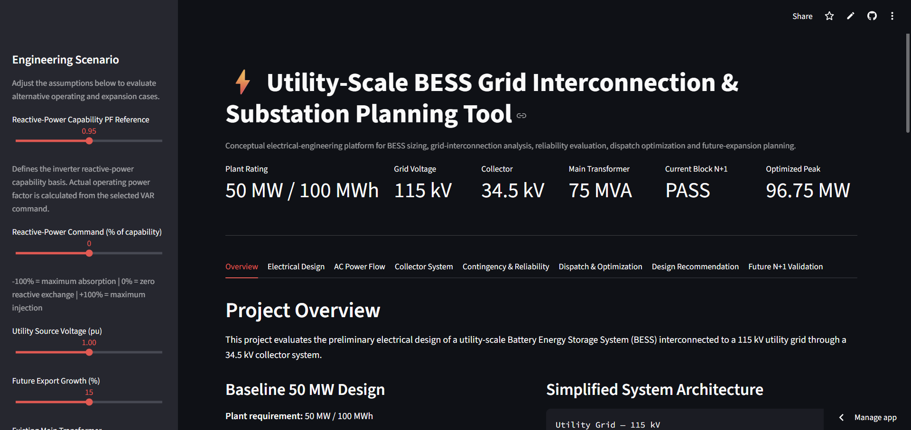

# ⚡ Utility-Scale BESS Grid Interconnection & Substation Planning Tool

A Python and Streamlit-based conceptual electrical-engineering tool for evaluating utility-scale Battery Energy Storage System (BESS) grid interconnection, substation capacity, AC power flow, N+1 reliability, future expansion, transformer sizing, dispatch optimization, and reactive-power support.

## 🌐 Live Interactive Demo

**[Launch the BESS Grid Interconnection Planning Tool](https://bess-grid-interconnection-tool.streamlit.app)**

### Application Preview

 

---

## Project Overview

This independent engineering project models the preliminary planning of a utility-scale BESS connected to a 115 kV utility grid through a 34.5 kV collector system.

The application evaluates alternative operating and expansion scenarios and recommends candidate configurations based on capacity, electrical performance, equipment loading, and N+1 reliability requirements.

### Baseline System

- **Plant requirement:** 50 MW / 100 MWh
- **BESS block size:** 5 MW / 10 MWh
- **Utility interconnection:** 115 kV
- **Collector system:** 34.5 kV
- **Existing main transformer:** 75 MVA
- **N+1 BESS block redundancy**
- **Future export-growth analysis:** 0–30%

Users can vary grid voltage, future export growth, reactive-power capability, reactive-power command, and transformer assumptions to evaluate how the system responds under different planning conditions.

---

## Main Features

### BESS Sizing
- Calculates the number of BESS blocks required to meet plant power and energy requirements
- Evaluates installed MW and MWh capacity
- Includes one-block N+1 redundancy
- Evaluates future export-growth requirements

### Transformer Analysis
- Compares candidate main-transformer ratings
- Calculates apparent-power loading
- Evaluates present and future transformer loading
- Uses a conceptual transformer-loading design target
- Provides automated transformer/design recommendations

### AC Power-Flow Analysis
- Models the BESS collector and grid-interconnection system
- Evaluates bus voltages
- Calculates network losses
- Checks transformer and feeder loading
- Evaluates modeled voltage-limit compliance

### Collector-System Modeling
Conceptual topology includes:

Utility Grid — 115 kV  
↓  
115 kV POI Bus  
↓  
Main 115 / 34.5 kV Transformer  
↓  
34.5 kV Collector Bus  
↓  
34.5 kV Feeders  
↓  
Block Transformers  
↓  
BESS Blocks

### Contingency & Reliability Analysis
- Evaluates N+1 BESS block redundancy
- Checks present and future capacity availability
- Evaluates electrical-operating constraints under contingency conditions
- Identifies design failures and constraint violations

### Future Expansion Planning
- User-selectable future export growth from 0% to 30%
- Evaluates whether installed BESS capacity remains adequate
- Recommends larger BESS and transformer configurations when required
- Performs future N+1 validation

### Reactive-Power & Voltage Support
- User-configurable reactive-power capability reference
- User-selectable reactive-power command
- Adjustable utility-source voltage
- Calculates actual operating power factor
- Evaluates reactive-power injection and absorption
- Detects modeled undervoltage and overvoltage conditions

### Automatic Reactive-Power Tuning
The automatic VAR tuner searches the available reactive-power operating range and identifies the minimum-magnitude reactive-power adjustment required to satisfy the modeled future N+1 electrical criteria.

For example:

- Low utility voltage → reactive-power injection
- High utility voltage → reactive-power absorption
- Nominal voltage → zero VAR support when compensation is unnecessary

### Dispatch & Optimization
- Simulates BESS dispatch behavior
- Tracks state of charge
- Estimates grid-power behavior
- Evaluates peak reduction
- Reports optimized peak demand

### Automated Engineering Recommendation
Candidate designs are evaluated against:

- Current N+1 capability
- Future capacity
- Future N+1 capability
- Transformer loading
- AC power flow
- Voltage limits
- Feeder loading
- Block-transformer loading

The application identifies both:

- Minimum Future-Ready Design
- Preferred Future N+1 Design

---

## Interactive Engineering Inputs

The Streamlit sidebar allows the user to modify:

- Reactive-Power Capability PF Reference
- Reactive-Power Command (% of capability)
- Utility Source Voltage (pu)
- Future Export Growth (%)
- Existing Main Transformer

This allows different operating and expansion scenarios to be evaluated without modifying the source code.

---

## Initial Design Basis

- Plant export requirement: 50 MW
- Energy requirement: 100 MWh
- Grid voltage: 115 kV
- Collector voltage: 34.5 kV
- BESS block rating: 5 MW / 10 MWh
- Reactive-power capability PF reference: 0.95
- Baseline future-growth case: 15%
- Conceptual transformer-loading design target: 85%

---

## Reference Scenario Checks

The model was exercised across several reference scenarios to verify consistent behavior.

| Scenario | Growth | Utility Voltage | VAR Response | Preferred N+1 Design | BESS | Transformer |
|---|---:|---:|---:|---|---|---|
| Baseline Growth | 0% | 1.00 pu | 0% | Option B | 55 MW / 110 MWh | 75 MVA |
| Nominal Planning Case | 15% | 1.00 pu | 0% | Option D | 65 MW / 130 MWh | 75 MVA |
| Maximum Growth | 30% | 1.00 pu | 0% | Option E | 70 MW / 140 MWh | 100 MVA |
| Undervoltage Support | 15% | 0.95 pu | +15% injection | Option D | 65 MW / 130 MWh | 75 MVA |
| Overvoltage Support | 15% | 1.05 pu | -10% absorption | Option D | 65 MW / 130 MWh | 75 MVA |
| Growth + Undervoltage | 30% | 0.95 pu | +15% injection | Option E | 70 MW / 140 MWh | 100 MVA |
| Growth + Overvoltage | 30% | 1.05 pu | -10% absorption | Option E | 70 MW / 140 MWh | 100 MVA |

These are reference scenario checks for the conceptual model rather than formal utility-study validation.

---

## Project Structure

```text
bess_grid_interconnection_starter/
│
├── app.py
├── main.py
├── README.md
├── requirements.txt
│
├── data/
├── results/
│
└── src/
    ├── bess_sizing.py
    ├── collector.py
    ├── contingencies.py
    ├── design_engine.py
    ├── dispatch.py
    ├── electrical.py
    ├── future_validation.py
    ├── optimizer.py
    ├── powerflow.py
    └── transformer.py
